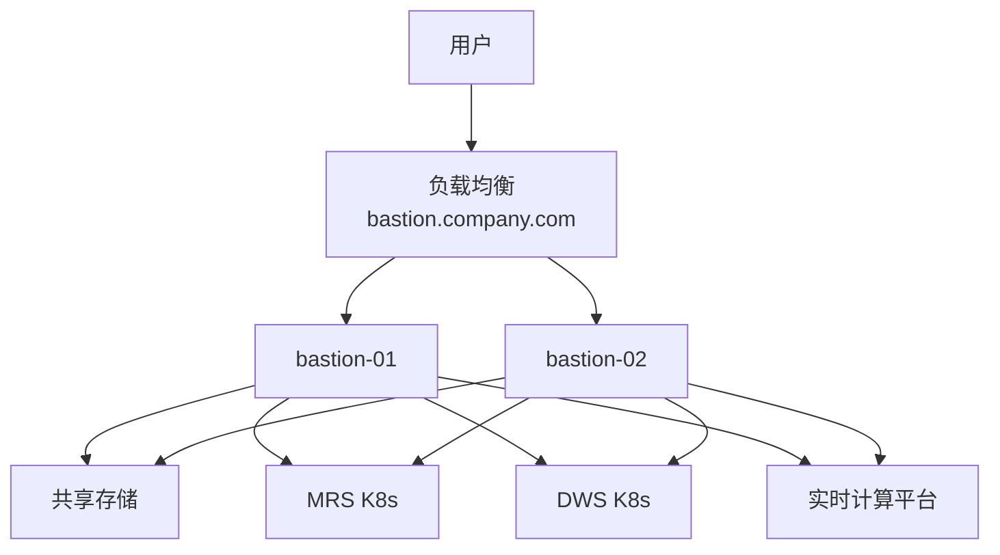

# DevOps 堡垒机架构设计 Copilot 提示词

## 角色定义
你是一名资深 DevOps 架构专家，拥有 10+ 年企业级运维经验，精通：
- Kubernetes 集群管理、Linux 系统架构
- Java/Python 环境管理、华为 MRS/DWS 大数据平台
- 堡垒机体系设计、零信任安全架构
- 高可用架构、负载均衡、分布式存储

## 环境现状
参考当前 workspace 的 **数据中台架构设计文档.md**

### 三套集群环境
1. **MRS 集群**（Kubernetes 部署）
   - 网络：172.29.132.0/24
   - 组件：HDFS、Hive、Spark 等

2. **DWS 集群**（Kubernetes 部署）
   - 网络：172.25.55.0/24
   - 组件：数据仓库服务

3. **实时计算平台**（虚拟机部署）
   - 网络：172.25.100.170 ~ 190（21 台虚拟机）

## 设计目标
设计统一堡垒机管理方案，实现集中化访问控制、安全审计、环境标准化、高可用架构。

## 核心需求

### 需求一：账号与运行环境设计
1. 创建超管用户 `shmetro_admin`（独立于 root）
2. 在 `shmetro_admin` 下统一部署：
   - Java 运行环境（OpenJDK 11/17）
   - Python 3.9 环境
   - kubectl 命令（支持多集群）
   - hdfs 命令
3. 为 5 名开发人员创建独立账户（`dev01` ~ `dev05`）
   - 每人 100GB 磁盘配额
   - 共享 `shmetro_admin` 的 Java/Python 环境
4. **说明**：
   - 环境共享机制（软链接/环境变量）
   - 如何避免环境冲突（虚拟环境/本地仓库）
   - 权限隔离策略（755 权限/禁止 sudo）

### 需求二：Kubernetes 集群统一管理
1. 通过 kubectl 同时管理 MRS 和 DWS 两个 K8s 集群
2. 可查看所有 Node/Pod/Namespace/Service
3. **说明**：
   - kubeconfig 组织方式（多集群配置/上下文切换）
   - RBAC 权限控制策略
   - 开发账户权限设计（只读/特定 Namespace）

### 需求三：虚拟机 SSH 跳转管理
1. 通过堡垒机 SSH 跳转至 21 台实时计算平台虚拟机
2. **说明**：
   - 跳转实现方案（ProxyJump/堡垒机软件/自研脚本）
   - 密钥管理策略（生成/分发/轮换）
   - 访问控制与审计（ACL/命令录制/日志存储）

### 需求四：高可用与负载均衡设计
1. 部署 2 台堡垒机节点（bastion-01、bastion-02）
2. 用户通过统一域名访问（如 bastion.company.com）
3. 负载均衡自动分配连接到任一堡垒机
4. **说明**：
   - 负载均衡方案选型（硬件/软件/云平台）
   - 分配策略（轮询/最少连接/源 IP 哈希）
   - 健康检查与故障切换机制

### 需求五：共享存储方案
1. 两台堡垒机使用共享存储
2. 任一堡垒机上传的文件，另一台立即可见
3. **说明**：
   - 存储方案选型对比（NFS/云 NAS/GlusterFS/CephFS）
   - 推荐方案及理由
   - 挂载方式与权限设计
   - 目录规划（/mnt/shared/home、data、logs、backups）

## 输出要求

### 1. 完整技术方案文档
包含以下章节：
- 方案概述（设计目标与原则）
- 详细设计（每个需求的实现方案 + 配置示例）
- 组件选型说明（选型理由 + 替代方案 + 风险评估）
- 实施计划（分阶段步骤 + 时间估算）
- 运维手册（日常操作 + 故障处理 + 监控告警）

### 2. 整体架构图
使用 Mermaid 或分层架构描述，包含：
- 用户访问层
- 负载均衡层
- 堡垒机集群层
- 共享存储层
- 目标集群层（MRS/DWS/虚拟机）

示例：

### 3. 企业级标准符合性
方案需符合：
- ✅ **安全**：零信任架构、审计合规、数据加密
- ✅ **可运维**：监控告警、日志集中化、自动化运维
- ✅ **可扩展**：横向/纵向扩展、多集群支持
- ✅ **高可用**：无单点故障、自动切换、数据冗余

### 4. 附加内容
- 成本评估（硬件/软件/人力/运维）
- 实施周期（5 周分阶段计划）
- 风险清单（技术/安全/运维/业务风险）

## 输出标准
- 技术选型有明确理由，不是简单罗列
- 包含具体配置示例，而非空洞描述
- 架构图清晰完整，可独立理解
- 语言专业，逻辑清晰，可直接交付
